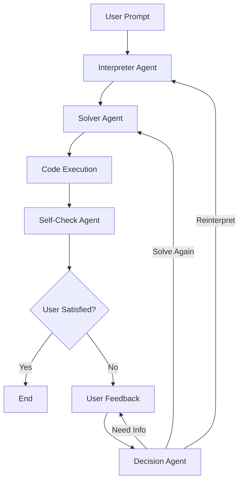

# Agent Flow Diagram

## ASCII Format

### Initial Flow (First Iteration)

```
┌─────────────────────────────────────────────────────────────────────────────┐
│                              USER PROMPT                                    │
│                      (Optimization Problem Statement)                       │
└────────────────────────────────┬────────────────────────────────────────────┘
                                 │
                                 v
                    ┌────────────────────────┐
                    │  INTERPRETER AGENT     │
                    │  (gpt-4o-mini)         │
                    │                        │
                    │  Extracts:             │
                    │  - Objective           │
                    │  - Variables           │
                    │  - Constraints         │
                    │  - Notes               │
                    └────────────┬───────────┘
                                 │
                                 │ structured_problem
                                 v
                    ┌────────────────────────┐
                    │   SOLVER AGENT         │
                    │   (gpt-4o-mini)        │
                    │                        │
                    │  Generates:            │
                    │  - Python code         │
                    │  - Uses gurobipy       │
                    │  - Optimization model  │
                    └────────────┬───────────┘
                                 │
                                 │ generated_code
                                 v
                    ┌────────────────────────┐
                    │   CODE EXECUTION       │
                    │   (PythonREPL)         │
                    │                        │
                    │  - Sanitizes code      │
                    │  - Executes (10s max)  │
                    │  - Returns output      │
                    └────────────┬───────────┘
                                 │
                                 │ execution_output
                                 v
                    ┌────────────────────────┐
                    │  SELF-CHECK AGENT      │
                    │  (gpt-4o-mini)         │
                    │                        │
                    │  Validates:            │
                    │  - Correctness         │
                    │  - Assumptions         │
                    │  - Metrics             │
                    │  - Implications        │
                    └────────────┬───────────┘
                                 │
                                 │ self_check_summary
                                 v
                    ┌────────────────────────┐
                    │   OUTPUT TO USER       │
                    │                        │
                    │  - Generated Code      │
                    │  - Execution Result    │
                    │  - Quality Summary     │
                    └────────────┬───────────┘
                                 │
                                 v
                    ┌────────────────────────┐
                    │  USER DECISION         │
                    │                        │
                    │  Run another iteration?│
                    │  (yes/no)              │
                    └────────────┬───────────┘
                                 │
                 ┌───────────────┴───────────────┐
                 │                               │
                NO                              YES
                 │                               │
                 v                               v
            ┌────────┐               ┌──────────────────────┐
            │  EXIT  │               │  PROVIDE FEEDBACK    │
            └────────┘               │  (additional context)│
                                     └──────────┬───────────┘
                                                │
                                                v
                                     [ITERATIVE FLOW BEGINS]
```

### Iterative Flow (Subsequent Iterations with Feedback Loop)

```
                    ┌────────────────────────────────────────────────┐
                    │           USER FEEDBACK PROVIDED               │
                    │       (Additional Context/Requirements)        │
                    └───────────────────────┬────────────────────────┘
                                           │
                                           v
                         ┌─────────────────────────────┐
                         │  ITERATIVE DECISION AGENT   │
                         │  (gpt-4o-mini)              │
                         │                             │
                         │  Analyzes:                  │
                         │  - Problem statement        │
                         │  - Previous solution        │
                         │  - Previous self-analysis   │
                         │  - User feedback            │
                         │                             │
                         │  Decides:                   │
                         │  - Next step (1, 2, or 3)   │
                         │  - New approach             │
                         │  - Considerations           │
                         └──────────────┬──────────────┘
                                        │
                                        │ decision output
                                        │
        ┌───────────────────────────────┼───────────────────────────────┐
        │                               │                               │
        │ next_step = 1                 │ next_step = 2                 │ next_step = 3
        │ REINTERPRET                   │ SOLVE AGAIN                   │ REQUEST INFO
        │                               │                               │
        v                               v                               v
┌──────────────────┐          ┌──────────────────┐          ┌──────────────────┐
│ INTERPRETER      │          │ SOLVER AGENT     │          │ REQUEST MORE     │
│ AGENT            │          │ (with updated    │          │ INFORMATION      │
│ (with feedback)  │          │ context)         │          │                  │
└────────┬─────────┘          └────────┬─────────┘          └────────┬─────────┘
         │                             │                             │
         v                             │                             v
┌──────────────────┐                   │                  ┌──────────────────┐
│ SOLVER AGENT     │                   │                  │ USER PROVIDES    │
│ (with reinter-   │                   │                  │ ADDITIONAL INFO  │
│  pretation)      │                   │                  └────────┬─────────┘
└────────┬─────────┘                   │                           │
         │                             │                           v
         └──────────────┬──────────────┘              ┌────────────────────┐
                        │                             │ RECURSIVE CALL     │
                        v                             │ path_subsequent    │
              ┌──────────────────┐                    │ (with new context) │
              │ SELF-CHECK AGENT │                    └─────────┬──────────┘
              │ (validates code  │                              │
              │  string only)    │                              │
              └────────┬─────────┘                              │
                       │                                        │
                       │                                        │
                       │ NOTE: Cases 1 & 2 skip execution      │
                       │ Code is generated but not run          │
                       │                                        │
                       v                                        │
              ┌──────────────────┐                              │
              │ OUTPUT TO USER   │                              │
              └────────┬─────────┘                              │
                       │                                        │
                       └────────────────────────────────────────┘
                                           │
                                           v
                              ┌────────────────────────┐
                              │  USER DECISION         │
                              │  Run another iteration?│
                              │  (yes/no)              │
                              └────────────┬───────────┘
                                           │
                          ┌────────────────┴────────────────┐
                          │                                 │
                         NO                                YES
                          │                                 │
                          v                                 │
                     ┌────────┐                             │
                     │  EXIT  │                             │
                     └────────┘                             │
                                                            │
                              ┌─────────────────────────────┘
                              │
                              v
                    [FEEDBACK LOOP CONTINUES]
```

### Complete System Overview

```
╔═══════════════════════════════════════════════════════════════════════════╗
║                        OPTIMUS GPT AGENT SYSTEM                           ║
║                    Optimization Problem Solver                            ║
╚═══════════════════════════════════════════════════════════════════════════╝

Input: User Prompt (Optimization Problem)
   │
   ├──> [path_initial] ──────────────────────────────────────┐
   │                                                          │
   │    1. Interpreter Agent (structured problem)            │
   │    2. Solver Agent (generate code)                      │
   │    3. Code Execution (run & get output)                 │
   │    4. Self-Check Agent (validate solution)              │
   │                                                          │
   └──────────────────────────────────────────────────────┬──┘
                                                          │
                                                          v
                                                    [Output & Prompt]
                                                          │
                                    ┌─────────────────────┴─────────────────────┐
                                    │                                           │
                                    │            User Satisfied?                │
                                    │                                           │
                                    └─────────────────┬─────────────────────────┘
                                                      │
                                      ┌───────────────┴───────────────┐
                                      │                               │
                                     YES                             NO
                                      │                               │
                                      v                               v
                                   [END]                    [Provide Feedback]
                                                                      │
   ┌──────────────────────────────────────────────────────────────────┘
   │
   ├──> [path_subsequent] ────────────────────────────────────┐
   │                                                           │
   │    1. Iterative Decision Agent (analyze & decide)        │
   │         │                                                │
   │         ├──> Case 1: Reinterpret Problem                 │
   │         │         │                                      │
   │         │         ├─> Interpreter Agent                  │
   │         │         └─> Solver Agent                       │
   │         │                                                │
   │         ├──> Case 2: Solve with Current Context         │
   │         │         │                                      │
   │         │         └─> Solver Agent (updated prompt)      │
   │         │                                                │
   │         └──> Case 3: Request More Information            │
   │                   │                                      │
   │                   ├─> User Provides Info                 │
   │                   └─> Recursive Call to path_subsequent  │
   │                                                           │
   │    2. Code Execution (for Cases 1 & 2)                   │
   │    3. Self-Check Agent (validate new solution)           │
   │                                                           │
   └───────────────────────────────────────────────────────┬──┘
                                                           │
                                                           v
                                                    [Output & Prompt]
                                                           │
                                                           └──> [LOOP BACK]
```

### Feedback Loop Detail

```
                                    FEEDBACK LOOPS
                                    
┌─────────────────────────────────────────────────────────────────────────────┐
│                                                                             │
│  PRIMARY FEEDBACK LOOP (Human-in-the-Loop)                                 │
│  ─────────────────────────────────────────                                 │
│                                                                             │
│     User ──> Feedback ──> Decision Agent ──> Strategy ──> Agents           │
│      ▲                                                         │            │
│      │                                                         │            │
│      └─────────────────── Output & Prompt ◄───────────────────┘            │
│                                                                             │
│  RECURSIVE FEEDBACK LOOP (Information Gathering)                           │
│  ────────────────────────────────────────────                              │
│                                                                             │
│     Decision Agent ──> "Need More Info" ──> User Prompt                    │
│           ▲                                        │                        │
│           │                                        │                        │
│           └───────────── User Provides ◄───────────┘                        │
│                          Additional Info                                   │
│                                                                             │
│  AGENT CHAINING (Sequential Processing)                                    │
│  ────────────────────────────────────────                                  │
│                                                                             │
│     Interpreter ──> Solver ──> Execution ──> Self-Check ──> Decision       │
│                      (Each agent's output feeds into the next)             │
│                                                                             │
└─────────────────────────────────────────────────────────────────────────────┘
```

## Important Notes

### Execution Behavior Differences
- **Initial Flow (`path_initial`)**: Code is executed via PythonREPL, and the execution output is validated
- **Iterative Flow (`path_subsequent`)**: For decision cases 1 & 2, code is generated but NOT executed. The Self-Check Agent validates the generated code string itself, not execution results. Only case 3 (recursive call) eventually executes code when it loops back.

## Agents Summary

### 1. Interpreter Agent
- **Purpose**: Parses and structures the optimization problem
- **Input**: Raw problem statement
- **Output**: Structured problem (objective, variables, constraints, notes)
- **Model**: GPT-4o-mini
- **Key Feature**: Uses structured output with Pydantic schema

### 2. Solver Agent
- **Purpose**: Generates Python code to solve the optimization problem
- **Input**: Formatted problem statement
- **Output**: Python code using gurobipy
- **Model**: GPT-4o-mini
- **Key Feature**: Expert in optimization code generation

### 3. Self-Check Agent
- **Purpose**: Validates the solution and provides quality summary
- **Input**: Problem statement + solution output
- **Output**: Verification summary with metrics and implications
- **Model**: GPT-4o-mini
- **Key Feature**: Quality assurance and validation

### 4. Iterative Decision Agent
- **Purpose**: Determines next steps based on feedback
- **Input**: Problem, previous solution, analysis, user feedback
- **Output**: Decision (1=reinterpret, 2=solve again, 3=request info)
- **Model**: GPT-4o-mini
- **Key Feature**: Adaptive strategy selection

### 5. Code Execution
- **Purpose**: Runs generated Python code safely
- **Input**: Sanitized Python code
- **Output**: Execution results
- **Tool**: LangChain PythonREPL
- **Timeout**: 10 seconds

## More Elegant Diagram Recommendations

### 1. **Mermaid Diagram** (Recommended - Best for Documentation)
**Advantages:**
- Native support in GitHub, GitLab, and many documentation platforms
- Interactive and clickable in supported viewers
- Version controllable (text-based)
- Automatically renders in markdown
- Easy to maintain and update
- Supports flowcharts, sequence diagrams, and state diagrams

**Implementation:**
- Use Mermaid Live Editor (https://mermaid.live)
- Embed in README.md or documentation
- Supports complex flows with decision points
- Can show parallel processes

**Example Tools:**
- Mermaid Live Editor: https://mermaid.live
- GitHub native rendering (`.md` files)
- VS Code extensions: Mermaid Preview

### 2. **PlantUML** (Great for Complex Systems)
**Advantages:**
- Powerful syntax for various diagram types
- Text-based (version controllable)
- Supports activity diagrams, sequence diagrams, component diagrams
- Can integrate with CI/CD pipelines
- Extensive customization options

**Implementation:**
- Use PlantUML online server
- Integrate with build process
- Export to PNG/SVG

**Tools:**
- PlantUML web server: http://www.plantuml.com/plantuml
- VS Code extension: PlantUML

### 3. **Graphviz/DOT** (For Complex Node Graphs)
**Advantages:**
- Automatic layout algorithms
- Text-based format
- Professional appearance
- Can handle very complex graphs
- Multiple output formats (PNG, SVG, PDF)

**Tools:**
- Graphviz Online: https://dreampuf.github.io/GraphvizOnline
- Command-line tool: `dot -Tpng input.dot -o output.png`

### 4. **Draw.io / Diagrams.net** (Visual Editor)
**Advantages:**
- User-friendly visual editor
- Can export to multiple formats
- Integration with GitHub
- Professional templates
- Can embed in documentation

**Tools:**
- Web version: https://app.diagrams.net
- VS Code extension: Draw.io Integration
- Desktop application available

### 5. **Excalidraw** (Modern Sketch Style)
**Advantages:**
- Beautiful hand-drawn aesthetic
- Collaborative editing
- Easy to use
- Export to PNG/SVG
- Open source

**Tools:**
- Web version: https://excalidraw.com
- VS Code extension: Excalidraw

### 6. **LucidChart or Figma** (Professional Tools)
**Advantages:**
- Professional quality output
- Team collaboration features
- Templates and libraries
- Advanced styling options

**Note:** These are commercial tools but offer free tiers

## Implementation Guide

### Quick Start with Mermaid (Recommended)

Create a file `AGENT_FLOW_MERMAID.md` with:



This will automatically render in GitHub!

## Conclusion

The ASCII diagrams above provide a comprehensive view of the agent flow and feedback loops. For a more elegant and interactive experience, I recommend using **Mermaid** diagrams as they:
1. Render automatically in GitHub
2. Are easy to maintain (text-based)
3. Support interactivity
4. Look professional
5. Can be version controlled

The feedback loops in the system are:
1. **Human-in-the-Loop**: User reviews output and provides feedback
2. **Iterative Refinement**: Decision agent analyzes feedback and chooses strategy
3. **Information Gathering**: Recursive calls when more information is needed
4. **Agent Chaining**: Each agent's output feeds into the next agent
