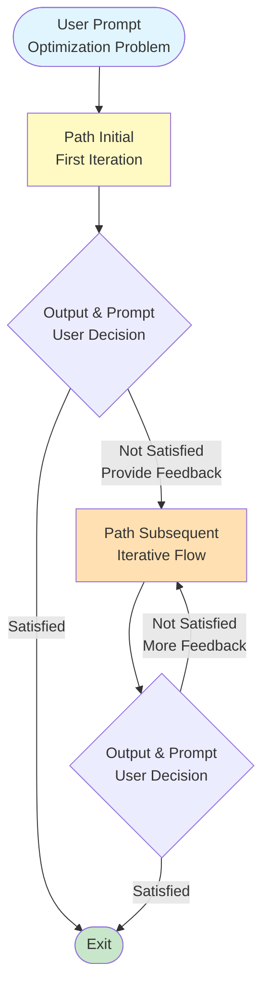
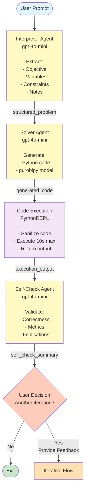
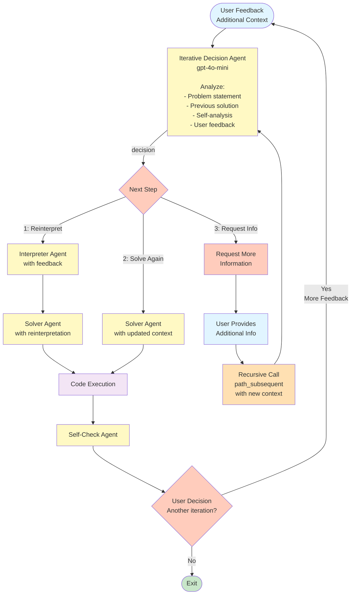
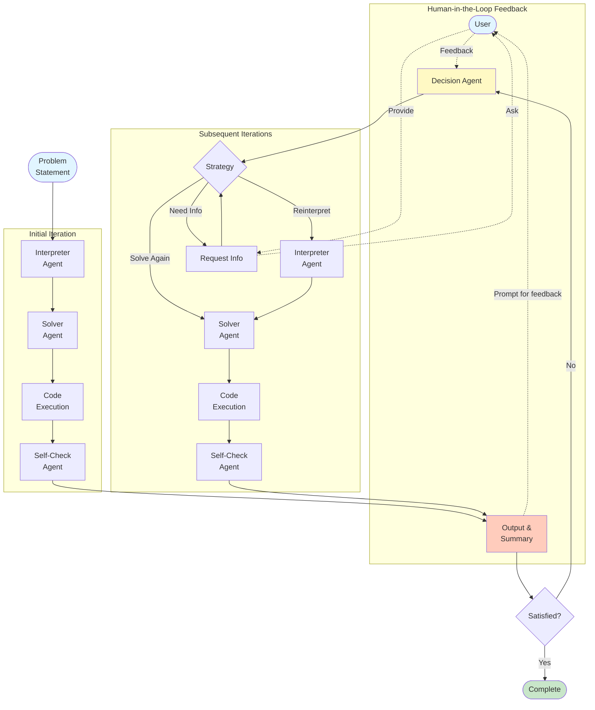
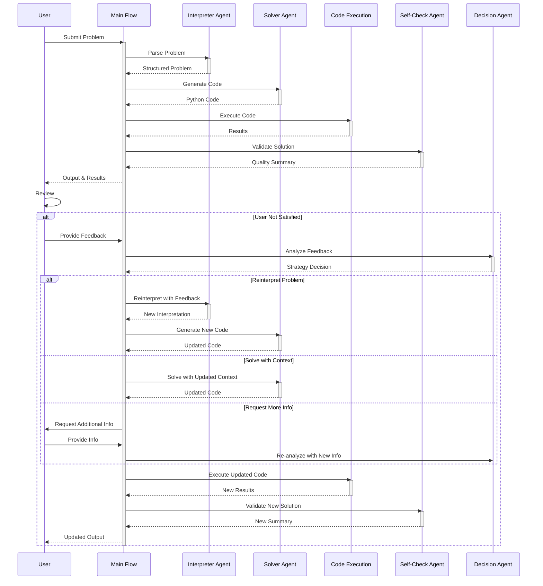
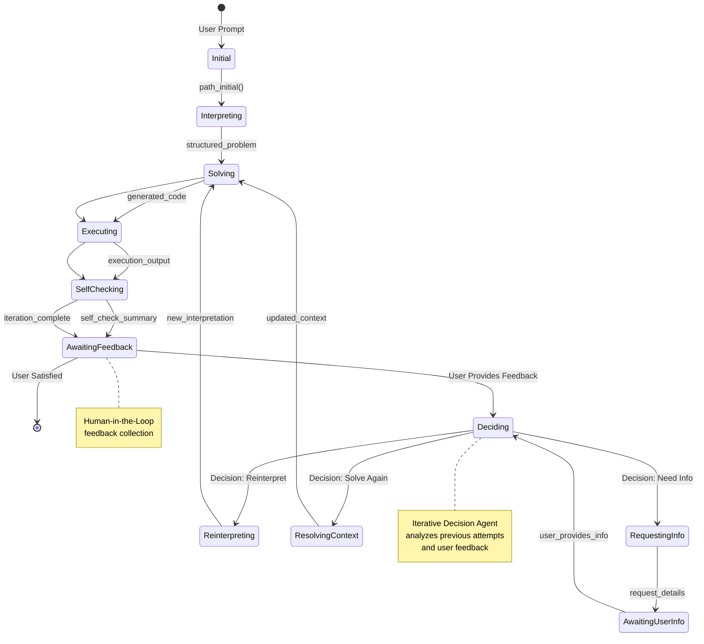
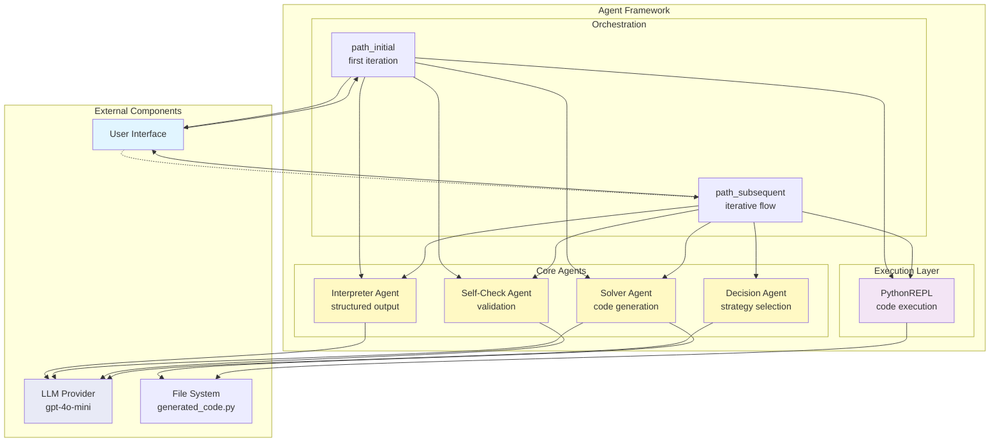
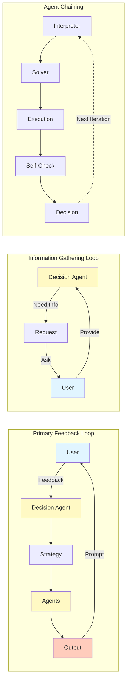
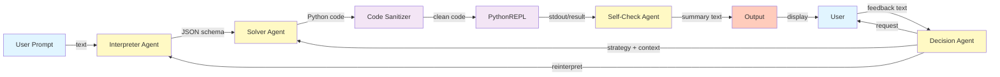

# Agent Flow Diagram - Mermaid Version

This document contains Mermaid diagrams that visualize the agent flow in optimusGPT. These diagrams will render automatically on GitHub and other platforms that support Mermaid.

## Overview Flow

## Initial Flow (First Iteration)

## Iterative Flow (Subsequent Iterations)

## Complete System with Feedback Loops

## Sequence Diagram (Interaction View)

## State Diagram (Agent States)

## Component Diagram (Architecture View)

## Feedback Loops Visualization

## Data Flow Diagram

---

## How to View These Diagrams

### On GitHub
These Mermaid diagrams will render automatically when viewing this file on GitHub.

### In VS Code
Install the "Markdown Preview Mermaid Support" extension to see live previews.

### Online Editors
Copy the Mermaid code to:
- https://mermaid.live for live editing and export
- https://mermaid.ink for quick rendering

### Export Options
From mermaid.live, you can export to:
- PNG (for documentation)
- SVG (for scalable graphics)
- PDF (for reports)

### Integration
These diagrams can be:
- Embedded in README.md
- Included in documentation sites
- Exported for presentations
- Version controlled with code
