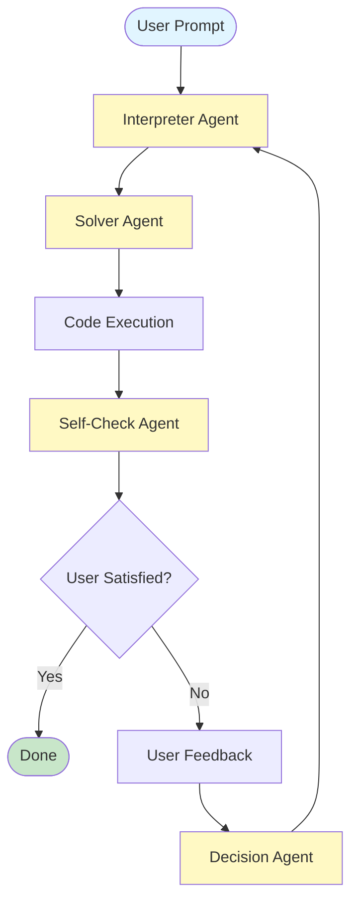

# OptimusGPT

An AI-powered optimization problem solver using multi-agent systems with human-in-the-loop feedback.

## Overview

OptimusGPT uses specialized AI agents to interpret, solve, and validate optimization problems. The system features intelligent feedback loops that allow for iterative refinement based on user input.

## 🎯 Key Features

- **Multi-Agent Architecture**: Specialized agents for interpretation, solving, validation, and decision-making
- **Human-in-the-Loop**: Interactive feedback system for iterative improvement
- **Automatic Code Generation**: Generates Python code using gurobipy for optimization problems
- **Quality Validation**: Self-checking mechanism to ensure solution correctness
- **Adaptive Strategies**: Intelligent decision-making based on feedback and previous attempts

## 📊 Agent Flow Diagrams

Visual representations of how agents interact and process optimization problems:

- **[Agent Flow Diagram (ASCII)](./AGENT_FLOW_DIAGRAM.md)** - Comprehensive ASCII diagrams with detailed explanations
- **[Agent Flow Diagram (Mermaid)](./AGENT_FLOW_MERMAID.md)** - Interactive diagrams that render on GitHub ⭐ Recommended
- **[Quick Reference Guide](./AGENT_FLOW_QUICK_REFERENCE.md)** - Quick lookup for agent types, flows, and patterns
- **[Architecture Flow](./architectureFlow.txt)** - High-level system architecture overview

### Quick Preview



## 🤖 Agents

### 1. Interpreter Agent
Parses and structures optimization problems into:
- Objectives
- Variables
- Constraints
- Assumptions

### 2. Solver Agent
Generates executable Python code using gurobipy to solve the optimization problem.

### 3. Self-Check Agent
Validates solutions by checking:
- Correctness
- Assumptions
- Performance metrics
- Real-world implications

### 4. Iterative Decision Agent
Analyzes feedback and chooses the next strategy:
1. **Reinterpret**: Re-parse the problem with new context
2. **Solve Again**: Try a different approach
3. **Request Info**: Ask user for missing information

## 🚀 Getting Started

### Prerequisites

- Python >= 3.11
- Poetry (for dependency management)

### Installation

```bash
# Clone the repository
git clone https://github.com/thang-dinh/optimusGPT.git
cd optimusGPT

# Install dependencies
cd Code
poetry install

# Set up environment variables
cp .env.example .env
# Edit .env with your OpenAI API key
```

### Configuration

Create a `.env` file in the `Code/` directory with:

```bash
OPENAI_API_KEY=your_api_key_here
```

### Running

```bash
cd Code
python main.py
```

## 📁 Project Structure

```
optimusGPT/
├── Code/
│   ├── agents/                  # Agent implementations
│   │   ├── interpreter_agent.py
│   │   ├── solver_agent.py
│   │   ├── self_check_agent.py
│   │   ├── iterative_decision_agent.py
│   │   └── visualizer_agent.py
│   ├── agent_paths/             # Flow orchestration
│   │   └── iterative_solver.py
│   ├── data/                    # Input data
│   ├── output_code/             # Generated code
│   ├── main.py                  # Entry point
│   └── pyproject.toml           # Dependencies
├── AGENT_FLOW_DIAGRAM.md        # ASCII diagrams
├── AGENT_FLOW_MERMAID.md        # Mermaid diagrams
├── AGENT_FLOW_QUICK_REFERENCE.md # Quick reference
├── architectureFlow.txt         # System architecture
└── README.md                    # This file
```

## 🔄 How It Works

### Initial Flow
1. User provides an optimization problem
2. **Interpreter Agent** structures the problem
3. **Solver Agent** generates Python code
4. Code is executed via **PythonREPL**
5. **Self-Check Agent** validates the solution
6. Results are presented to the user

### Iterative Flow (with Feedback)
1. User provides feedback on initial solution
2. **Decision Agent** analyzes feedback and previous attempts
3. Based on the analysis, one of three strategies is chosen:
   - **Reinterpret**: Problem understanding was incorrect
   - **Solve Again**: Try a different approach
   - **Request Info**: Need more information from user
4. New solution is generated (but may not be executed)
5. **Self-Check Agent** validates
6. Process repeats until user is satisfied

## 🎨 Visualization Options

The agent flow can be visualized using various tools:

1. **Mermaid** (Recommended)
   - Renders automatically on GitHub
   - Interactive and clickable
   - Export to PNG/SVG/PDF
   - Try it at [mermaid.live](https://mermaid.live)

2. **ASCII Diagrams**
   - Universal compatibility
   - Works in any text viewer
   - Version control friendly

3. **PlantUML, Graphviz, Draw.io, Excalidraw**
   - See [AGENT_FLOW_DIAGRAM.md](./AGENT_FLOW_DIAGRAM.md) for details

## 🔧 Technologies

- **LangChain** - Agent framework and orchestration
- **OpenAI GPT-4o-mini** - Language model for all agents
- **gurobipy** - Optimization solver
- **Python 3.12** - Runtime environment
- **Pydantic** - Data validation and structured outputs

## 📝 Example Usage

```python
from Code.agent_paths.iterative_solver import path_initial, path_subsequent

# First iteration
problem = "Minimize transportation costs for delivering goods from 3 warehouses to 5 stores"
code_output, summary = path_initial(problem)

# Subsequent iteration with feedback
feedback = "Also consider maximum capacity constraints for each warehouse"
new_output, new_summary = path_subsequent(
    problem,
    code_output,
    summary,
    feedback
)
```

## 🤝 Contributing

Contributions are welcome! To add new agents or improve existing ones:

1. Follow the existing agent structure in `Code/agents/`
2. Use structured outputs with Pydantic models
3. Update flow orchestration in `agent_paths/iterative_solver.py`
4. Update the flow diagrams
5. Add tests if applicable

## 📖 Documentation

For detailed information about the agent flow and feedback loops:
- [Agent Flow Diagram (ASCII)](./AGENT_FLOW_DIAGRAM.md) - Comprehensive ASCII diagrams
- [Agent Flow Diagram (Mermaid)](./AGENT_FLOW_MERMAID.md) - Interactive Mermaid diagrams
- [Quick Reference](./AGENT_FLOW_QUICK_REFERENCE.md) - Cheat sheet for agents and flows
- [Architecture Flow](./architectureFlow.txt) - System architecture

## 🐛 Troubleshooting

### Common Issues

**"Agent not responding"**
- Check your `.env` file has valid `OPENAI_API_KEY`
- Verify internet connection

**"Code execution timeout"**
- Increase timeout in `iterative_solver.py` line 34
- Default is 10 seconds

**"Import errors"**
- Run `poetry install` to install dependencies
- Check Python version >= 3.11

**"Understanding the flow"**
- Check the [Mermaid diagrams](./AGENT_FLOW_MERMAID.md) for visual representation
- Add print statements in `iterative_solver.py` for debugging
- Review [Quick Reference](./AGENT_FLOW_QUICK_REFERENCE.md)

## 📄 License

[Add your license information here]

## 👥 Authors

- Thang Dinh ([@thang-dinh](https://github.com/thang-dinh))

## 🙏 Acknowledgments

- Built with [LangChain](https://python.langchain.com/)
- Powered by [OpenAI](https://openai.com/)
- Optimization by [Gurobi](https://www.gurobi.com/)

---

**Need help?** Check out the [Quick Reference Guide](./AGENT_FLOW_QUICK_REFERENCE.md) or open an issue!
